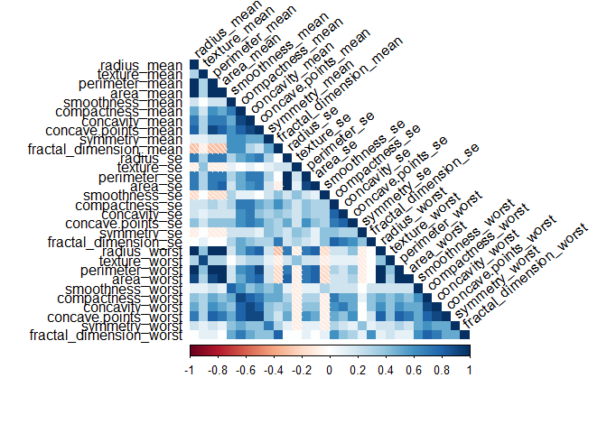

Data Cancer Diagnosis
=====================

Dataset Overview
----------------

The Breast Cancer (Wisconsin) dataset used in this paper is publicly
available in the UCI machine learning repository and was created by Dr.
William H. Wolberg, Dr. W. Nick Street, and Olvi L. Mangasarian. The
doner is W. Nick Street. The dataset is created by Dr. Wolberg by taking
suspected tumor samples via a thin needle from patient's solid breast
masses and the samples are placed on dent-shaped glass slides. The slide
is dent shaped in order to distinguish the nearby cells with the tumor
cells. The collected tissue samples are then examined under microscope
and features are computed from the digitized image of a fine needle
aspirate (FNA) of breast mass. This is done via a graphical computer
program, which is capable of performing the analysis of cytological
features based on a digital scan.

Dataset: [Breast Cancer (Wisconsin)
dataset](http://archive.ics.uci.edu/ml/datasets/breast+cancer+wisconsin+%28diagnostic%29)

This is a classification dataset consisting of:

-   569 Instances
-   32 features
-   No missing values

The attributes are:

1.  ID number
2.  Diagnosis (M = malignant, B = benign)
3.  (3-32) Ten real-valued features are computed for each cell nucleus:

<!-- -->

1.  radius (mean of distances from center to points on the perimeter)
2.  texture (standard deviation of gray-scale values)
3.  perimeter
4.  area
5.  smoothness (local variation in radius lengths)
6.  compactness (perimeter^2 / area - 1.0)
7.  concavity (severity of concave portions of the contour)
8.  concave points (number of concave portions of the contour)
9.  symmetry
10. fractal dimension ("coastline approximation" - 1)

Analysis
--------

Three machine learning methods are compared in this paper based on the
overall accuracy, misclassification error, and the area under the ROC
curve. These classification methods are used to predict the diagnosis
result of the breast cancer which can be either benign or malignant in
nature. To create the classifier, the WBCD (Wisconsin Breast Cancer
Diagnosis) dataset is used. The dataset is widely utilized for this kind
of application because it has many instances, it is virtually noise-free
and has no case of missing values. Prior to the analysis, a large
fraction of this work will be dedicated for cleaning and pre-processing
the data to optimize the classifier. The highly correlated features are
identified and dimension reduction is done on the dataset. The first
part of this work is to overview the database, what information does it
contains, when and how it was created, if it is noisy, if it has missing
values. This section is important to understand what are the issues that
will need to be processed while preparing the data to create the
classifier. The second part is to propose the machine learning methods
and algorithms to optimize the training set and different solutions are
proposed.

### Required Packages

    library(dplyr)

    ## 
    ## Attaching package: 'dplyr'

    ## The following objects are masked from 'package:stats':
    ## 
    ##     filter, lag

    ## The following objects are masked from 'package:base':
    ## 
    ##     intersect, setdiff, setequal, union

    library(magrittr)
    library(corrplot)

    ## corrplot 0.84 loaded

    library(kernlab)
    library(pROC)

    ## Type 'citation("pROC")' for a citation.

    ## 
    ## Attaching package: 'pROC'

    ## The following objects are masked from 'package:stats':
    ## 
    ##     cov, smooth, var

    library(rpart)
    library(MASS)

    ## 
    ## Attaching package: 'MASS'

    ## The following object is masked from 'package:dplyr':
    ## 
    ##     select

    library(caret)

    ## Loading required package: lattice

    ## Loading required package: ggplot2

    ## 
    ## Attaching package: 'ggplot2'

    ## The following object is masked from 'package:kernlab':
    ## 
    ##     alpha

    library(caTools)
    library(ranger)
    library(e1071)
    library(randomForest)

    ## randomForest 4.6-14

    ## Type rfNews() to see new features/changes/bug fixes.

    ## 
    ## Attaching package: 'randomForest'

    ## The following object is masked from 'package:ranger':
    ## 
    ##     importance

    ## The following object is masked from 'package:ggplot2':
    ## 
    ##     margin

    ## The following object is masked from 'package:dplyr':
    ## 
    ##     combine

    library(tidyverse)

    ## -- Attaching packages ---------------------------------- tidyverse 1.2.1 --

    ## v tibble  1.4.2     v purrr   0.2.4
    ## v tidyr   0.8.0     v stringr 1.3.0
    ## v readr   1.1.1     v forcats 0.3.0

    ## -- Conflicts ------------------------------------- tidyverse_conflicts() --
    ## x ggplot2::alpha()        masks kernlab::alpha()
    ## x randomForest::combine() masks dplyr::combine()
    ## x purrr::cross()          masks kernlab::cross()
    ## x tidyr::extract()        masks magrittr::extract()
    ## x dplyr::filter()         masks stats::filter()
    ## x dplyr::lag()            masks stats::lag()
    ## x purrr::lift()           masks caret::lift()
    ## x randomForest::margin()  masks ggplot2::margin()
    ## x MASS::select()          masks dplyr::select()
    ## x purrr::set_names()      masks magrittr::set_names()

### Loading the data

    data <- read.csv(".//data.csv", header =TRUE)
    dim(data)

    ## [1] 569  33

    head(data)

    ##         id diagnosis radius_mean texture_mean perimeter_mean area_mean
    ## 1   842302         M       17.99        10.38         122.80    1001.0
    ## 2   842517         M       20.57        17.77         132.90    1326.0
    ## 3 84300903         M       19.69        21.25         130.00    1203.0
    ## 4 84348301         M       11.42        20.38          77.58     386.1
    ## 5 84358402         M       20.29        14.34         135.10    1297.0
    ## 6   843786         M       12.45        15.70          82.57     477.1
    ##   smoothness_mean compactness_mean concavity_mean concave.points_mean
    ## 1         0.11840          0.27760         0.3001             0.14710
    ## 2         0.08474          0.07864         0.0869             0.07017
    ## 3         0.10960          0.15990         0.1974             0.12790
    ## 4         0.14250          0.28390         0.2414             0.10520
    ## 5         0.10030          0.13280         0.1980             0.10430
    ## 6         0.12780          0.17000         0.1578             0.08089
    ##   symmetry_mean fractal_dimension_mean radius_se texture_se perimeter_se
    ## 1        0.2419                0.07871    1.0950     0.9053        8.589
    ## 2        0.1812                0.05667    0.5435     0.7339        3.398
    ## 3        0.2069                0.05999    0.7456     0.7869        4.585
    ## 4        0.2597                0.09744    0.4956     1.1560        3.445
    ## 5        0.1809                0.05883    0.7572     0.7813        5.438
    ## 6        0.2087                0.07613    0.3345     0.8902        2.217
    ##   area_se smoothness_se compactness_se concavity_se concave.points_se
    ## 1  153.40      0.006399        0.04904      0.05373           0.01587
    ## 2   74.08      0.005225        0.01308      0.01860           0.01340
    ## 3   94.03      0.006150        0.04006      0.03832           0.02058
    ## 4   27.23      0.009110        0.07458      0.05661           0.01867
    ## 5   94.44      0.011490        0.02461      0.05688           0.01885
    ## 6   27.19      0.007510        0.03345      0.03672           0.01137
    ##   symmetry_se fractal_dimension_se radius_worst texture_worst
    ## 1     0.03003             0.006193        25.38         17.33
    ## 2     0.01389             0.003532        24.99         23.41
    ## 3     0.02250             0.004571        23.57         25.53
    ## 4     0.05963             0.009208        14.91         26.50
    ## 5     0.01756             0.005115        22.54         16.67
    ## 6     0.02165             0.005082        15.47         23.75
    ##   perimeter_worst area_worst smoothness_worst compactness_worst
    ## 1          184.60     2019.0           0.1622            0.6656
    ## 2          158.80     1956.0           0.1238            0.1866
    ## 3          152.50     1709.0           0.1444            0.4245
    ## 4           98.87      567.7           0.2098            0.8663
    ## 5          152.20     1575.0           0.1374            0.2050
    ## 6          103.40      741.6           0.1791            0.5249
    ##   concavity_worst concave.points_worst symmetry_worst
    ## 1          0.7119               0.2654         0.4601
    ## 2          0.2416               0.1860         0.2750
    ## 3          0.4504               0.2430         0.3613
    ## 4          0.6869               0.2575         0.6638
    ## 5          0.4000               0.1625         0.2364
    ## 6          0.5355               0.1741         0.3985
    ##   fractal_dimension_worst  X
    ## 1                 0.11890 NA
    ## 2                 0.08902 NA
    ## 3                 0.08758 NA
    ## 4                 0.17300 NA
    ## 5                 0.07678 NA
    ## 6                 0.12440 NA

    str(data)

    ## 'data.frame':    569 obs. of  33 variables:
    ##  $ id                     : int  842302 842517 84300903 84348301 84358402 843786 844359 84458202 844981 84501001 ...
    ##  $ diagnosis              : Factor w/ 2 levels "B","M": 2 2 2 2 2 2 2 2 2 2 ...
    ##  $ radius_mean            : num  18 20.6 19.7 11.4 20.3 ...
    ##  $ texture_mean           : num  10.4 17.8 21.2 20.4 14.3 ...
    ##  $ perimeter_mean         : num  122.8 132.9 130 77.6 135.1 ...
    ##  $ area_mean              : num  1001 1326 1203 386 1297 ...
    ##  $ smoothness_mean        : num  0.1184 0.0847 0.1096 0.1425 0.1003 ...
    ##  $ compactness_mean       : num  0.2776 0.0786 0.1599 0.2839 0.1328 ...
    ##  $ concavity_mean         : num  0.3001 0.0869 0.1974 0.2414 0.198 ...
    ##  $ concave.points_mean    : num  0.1471 0.0702 0.1279 0.1052 0.1043 ...
    ##  $ symmetry_mean          : num  0.242 0.181 0.207 0.26 0.181 ...
    ##  $ fractal_dimension_mean : num  0.0787 0.0567 0.06 0.0974 0.0588 ...
    ##  $ radius_se              : num  1.095 0.543 0.746 0.496 0.757 ...
    ##  $ texture_se             : num  0.905 0.734 0.787 1.156 0.781 ...
    ##  $ perimeter_se           : num  8.59 3.4 4.58 3.44 5.44 ...
    ##  $ area_se                : num  153.4 74.1 94 27.2 94.4 ...
    ##  $ smoothness_se          : num  0.0064 0.00522 0.00615 0.00911 0.01149 ...
    ##  $ compactness_se         : num  0.049 0.0131 0.0401 0.0746 0.0246 ...
    ##  $ concavity_se           : num  0.0537 0.0186 0.0383 0.0566 0.0569 ...
    ##  $ concave.points_se      : num  0.0159 0.0134 0.0206 0.0187 0.0188 ...
    ##  $ symmetry_se            : num  0.03 0.0139 0.0225 0.0596 0.0176 ...
    ##  $ fractal_dimension_se   : num  0.00619 0.00353 0.00457 0.00921 0.00511 ...
    ##  $ radius_worst           : num  25.4 25 23.6 14.9 22.5 ...
    ##  $ texture_worst          : num  17.3 23.4 25.5 26.5 16.7 ...
    ##  $ perimeter_worst        : num  184.6 158.8 152.5 98.9 152.2 ...
    ##  $ area_worst             : num  2019 1956 1709 568 1575 ...
    ##  $ smoothness_worst       : num  0.162 0.124 0.144 0.21 0.137 ...
    ##  $ compactness_worst      : num  0.666 0.187 0.424 0.866 0.205 ...
    ##  $ concavity_worst        : num  0.712 0.242 0.45 0.687 0.4 ...
    ##  $ concave.points_worst   : num  0.265 0.186 0.243 0.258 0.163 ...
    ##  $ symmetry_worst         : num  0.46 0.275 0.361 0.664 0.236 ...
    ##  $ fractal_dimension_worst: num  0.1189 0.089 0.0876 0.173 0.0768 ...
    ##  $ X                      : logi  NA NA NA NA NA NA ...

### Data Pre-Processing

Looking at the data, we can remove the 33rd column since all values in
this column are "NA". Also, we can remove id column as it plays no part
in predicting the diagnosis. Change the column number 2 into facor.

    data$diagnosis <- as.factor(data$diagnosis)
    cleaned_dataset <- data[,3:32]
    head(cleaned_dataset)

    ##   radius_mean texture_mean perimeter_mean area_mean smoothness_mean
    ## 1       17.99        10.38         122.80    1001.0         0.11840
    ## 2       20.57        17.77         132.90    1326.0         0.08474
    ## 3       19.69        21.25         130.00    1203.0         0.10960
    ## 4       11.42        20.38          77.58     386.1         0.14250
    ## 5       20.29        14.34         135.10    1297.0         0.10030
    ## 6       12.45        15.70          82.57     477.1         0.12780
    ##   compactness_mean concavity_mean concave.points_mean symmetry_mean
    ## 1          0.27760         0.3001             0.14710        0.2419
    ## 2          0.07864         0.0869             0.07017        0.1812
    ## 3          0.15990         0.1974             0.12790        0.2069
    ## 4          0.28390         0.2414             0.10520        0.2597
    ## 5          0.13280         0.1980             0.10430        0.1809
    ## 6          0.17000         0.1578             0.08089        0.2087
    ##   fractal_dimension_mean radius_se texture_se perimeter_se area_se
    ## 1                0.07871    1.0950     0.9053        8.589  153.40
    ## 2                0.05667    0.5435     0.7339        3.398   74.08
    ## 3                0.05999    0.7456     0.7869        4.585   94.03
    ## 4                0.09744    0.4956     1.1560        3.445   27.23
    ## 5                0.05883    0.7572     0.7813        5.438   94.44
    ## 6                0.07613    0.3345     0.8902        2.217   27.19
    ##   smoothness_se compactness_se concavity_se concave.points_se symmetry_se
    ## 1      0.006399        0.04904      0.05373           0.01587     0.03003
    ## 2      0.005225        0.01308      0.01860           0.01340     0.01389
    ## 3      0.006150        0.04006      0.03832           0.02058     0.02250
    ## 4      0.009110        0.07458      0.05661           0.01867     0.05963
    ## 5      0.011490        0.02461      0.05688           0.01885     0.01756
    ## 6      0.007510        0.03345      0.03672           0.01137     0.02165
    ##   fractal_dimension_se radius_worst texture_worst perimeter_worst
    ## 1             0.006193        25.38         17.33          184.60
    ## 2             0.003532        24.99         23.41          158.80
    ## 3             0.004571        23.57         25.53          152.50
    ## 4             0.009208        14.91         26.50           98.87
    ## 5             0.005115        22.54         16.67          152.20
    ## 6             0.005082        15.47         23.75          103.40
    ##   area_worst smoothness_worst compactness_worst concavity_worst
    ## 1     2019.0           0.1622            0.6656          0.7119
    ## 2     1956.0           0.1238            0.1866          0.2416
    ## 3     1709.0           0.1444            0.4245          0.4504
    ## 4      567.7           0.2098            0.8663          0.6869
    ## 5     1575.0           0.1374            0.2050          0.4000
    ## 6      741.6           0.1791            0.5249          0.5355
    ##   concave.points_worst symmetry_worst fractal_dimension_worst
    ## 1               0.2654         0.4601                 0.11890
    ## 2               0.1860         0.2750                 0.08902
    ## 3               0.2430         0.3613                 0.08758
    ## 4               0.2575         0.6638                 0.17300
    ## 5               0.1625         0.2364                 0.07678
    ## 6               0.1741         0.3985                 0.12440

    str(cleaned_dataset)

    ## 'data.frame':    569 obs. of  30 variables:
    ##  $ radius_mean            : num  18 20.6 19.7 11.4 20.3 ...
    ##  $ texture_mean           : num  10.4 17.8 21.2 20.4 14.3 ...
    ##  $ perimeter_mean         : num  122.8 132.9 130 77.6 135.1 ...
    ##  $ area_mean              : num  1001 1326 1203 386 1297 ...
    ##  $ smoothness_mean        : num  0.1184 0.0847 0.1096 0.1425 0.1003 ...
    ##  $ compactness_mean       : num  0.2776 0.0786 0.1599 0.2839 0.1328 ...
    ##  $ concavity_mean         : num  0.3001 0.0869 0.1974 0.2414 0.198 ...
    ##  $ concave.points_mean    : num  0.1471 0.0702 0.1279 0.1052 0.1043 ...
    ##  $ symmetry_mean          : num  0.242 0.181 0.207 0.26 0.181 ...
    ##  $ fractal_dimension_mean : num  0.0787 0.0567 0.06 0.0974 0.0588 ...
    ##  $ radius_se              : num  1.095 0.543 0.746 0.496 0.757 ...
    ##  $ texture_se             : num  0.905 0.734 0.787 1.156 0.781 ...
    ##  $ perimeter_se           : num  8.59 3.4 4.58 3.44 5.44 ...
    ##  $ area_se                : num  153.4 74.1 94 27.2 94.4 ...
    ##  $ smoothness_se          : num  0.0064 0.00522 0.00615 0.00911 0.01149 ...
    ##  $ compactness_se         : num  0.049 0.0131 0.0401 0.0746 0.0246 ...
    ##  $ concavity_se           : num  0.0537 0.0186 0.0383 0.0566 0.0569 ...
    ##  $ concave.points_se      : num  0.0159 0.0134 0.0206 0.0187 0.0188 ...
    ##  $ symmetry_se            : num  0.03 0.0139 0.0225 0.0596 0.0176 ...
    ##  $ fractal_dimension_se   : num  0.00619 0.00353 0.00457 0.00921 0.00511 ...
    ##  $ radius_worst           : num  25.4 25 23.6 14.9 22.5 ...
    ##  $ texture_worst          : num  17.3 23.4 25.5 26.5 16.7 ...
    ##  $ perimeter_worst        : num  184.6 158.8 152.5 98.9 152.2 ...
    ##  $ area_worst             : num  2019 1956 1709 568 1575 ...
    ##  $ smoothness_worst       : num  0.162 0.124 0.144 0.21 0.137 ...
    ##  $ compactness_worst      : num  0.666 0.187 0.424 0.866 0.205 ...
    ##  $ concavity_worst        : num  0.712 0.242 0.45 0.687 0.4 ...
    ##  $ concave.points_worst   : num  0.265 0.186 0.243 0.258 0.163 ...
    ##  $ symmetry_worst         : num  0.46 0.275 0.361 0.664 0.236 ...
    ##  $ fractal_dimension_worst: num  0.1189 0.089 0.0876 0.173 0.0768 ...

### Data Visualization

    round(prop.table(table(data$diagnosis)), 2)

    ## 
    ##    B    M 
    ## 0.63 0.37

The data is slightly unbalanced with 67% of benignant nature and 37% of
malignant phenomenon.

Checking for coorelation using findcorrelation function from the caret
package with cutoff of 90%.

    corr_mat <- round(cor(cleaned_dataset, method = "pearson"),1)
    df2 <- cleaned_dataset %>% 
      dplyr::select(-findCorrelation(corr_mat, cutoff = 0.9))
    dim(df2)

    ## [1] 569  24

    colnames(df2)

    ##  [1] "radius_mean"             "texture_mean"           
    ##  [3] "smoothness_mean"         "compactness_mean"       
    ##  [5] "concavity_mean"          "concave.points_mean"    
    ##  [7] "symmetry_mean"           "fractal_dimension_mean" 
    ##  [9] "radius_se"               "texture_se"             
    ## [11] "smoothness_se"           "compactness_se"         
    ## [13] "concavity_se"            "concave.points_se"      
    ## [15] "symmetry_se"             "fractal_dimension_se"   
    ## [17] "texture_worst"           "area_worst"             
    ## [19] "smoothness_worst"        "compactness_worst"      
    ## [21] "concavity_worst"         "concave.points_worst"   
    ## [23] "symmetry_worst"          "fractal_dimension_worst"

    colnames(cleaned_dataset)

    ##  [1] "radius_mean"             "texture_mean"           
    ##  [3] "perimeter_mean"          "area_mean"              
    ##  [5] "smoothness_mean"         "compactness_mean"       
    ##  [7] "concavity_mean"          "concave.points_mean"    
    ##  [9] "symmetry_mean"           "fractal_dimension_mean" 
    ## [11] "radius_se"               "texture_se"             
    ## [13] "perimeter_se"            "area_se"                
    ## [15] "smoothness_se"           "compactness_se"         
    ## [17] "concavity_se"            "concave.points_se"      
    ## [19] "symmetry_se"             "fractal_dimension_se"   
    ## [21] "radius_worst"            "texture_worst"          
    ## [23] "perimeter_worst"         "area_worst"             
    ## [25] "smoothness_worst"        "compactness_worst"      
    ## [27] "concavity_worst"         "concave.points_worst"   
    ## [29] "symmetry_worst"          "fractal_dimension_worst"

Correlation Plot

    ## Correlation plot for original dataset
    corrplot(corr_mat, tl.col = "black", method = "shade",type = "lower",mar=c(0,1,0,1), tl.srt = 40)

From the correlation plot, we can see that the dataset consists of
highly correlated features, therefore some of the highly correlated
features are to be removed.

### Dimension Reduction

    df3 <- cleaned_dataset[,c(4,5,6,9,10,11,12,15,16,17,18,19,20,22,25,26,27,28,29,30)]
    dim(df3)

    ## [1] 569  20

    ## Correlation plot for cleaned dataset
    corrplot(round(cor(df3),1), tl.col = "black", method = "shade", type = "lower",mar=c(0,1,0,1), tl.srt = 40)

### Training and Testing dataset

    df4 <- cbind(diagnosis = data$diagnosis, df3)
    head(df4)

    ##   diagnosis area_mean smoothness_mean compactness_mean symmetry_mean
    ## 1         M    1001.0         0.11840          0.27760        0.2419
    ## 2         M    1326.0         0.08474          0.07864        0.1812
    ## 3         M    1203.0         0.10960          0.15990        0.2069
    ## 4         M     386.1         0.14250          0.28390        0.2597
    ## 5         M    1297.0         0.10030          0.13280        0.1809
    ## 6         M     477.1         0.12780          0.17000        0.2087
    ##   fractal_dimension_mean radius_se texture_se smoothness_se compactness_se
    ## 1                0.07871    1.0950     0.9053      0.006399        0.04904
    ## 2                0.05667    0.5435     0.7339      0.005225        0.01308
    ## 3                0.05999    0.7456     0.7869      0.006150        0.04006
    ## 4                0.09744    0.4956     1.1560      0.009110        0.07458
    ## 5                0.05883    0.7572     0.7813      0.011490        0.02461
    ## 6                0.07613    0.3345     0.8902      0.007510        0.03345
    ##   concavity_se concave.points_se symmetry_se fractal_dimension_se
    ## 1      0.05373           0.01587     0.03003             0.006193
    ## 2      0.01860           0.01340     0.01389             0.003532
    ## 3      0.03832           0.02058     0.02250             0.004571
    ## 4      0.05661           0.01867     0.05963             0.009208
    ## 5      0.05688           0.01885     0.01756             0.005115
    ## 6      0.03672           0.01137     0.02165             0.005082
    ##   texture_worst smoothness_worst compactness_worst concavity_worst
    ## 1         17.33           0.1622            0.6656          0.7119
    ## 2         23.41           0.1238            0.1866          0.2416
    ## 3         25.53           0.1444            0.4245          0.4504
    ## 4         26.50           0.2098            0.8663          0.6869
    ## 5         16.67           0.1374            0.2050          0.4000
    ## 6         23.75           0.1791            0.5249          0.5355
    ##   concave.points_worst symmetry_worst fractal_dimension_worst
    ## 1               0.2654         0.4601                 0.11890
    ## 2               0.1860         0.2750                 0.08902
    ## 3               0.2430         0.3613                 0.08758
    ## 4               0.2575         0.6638                 0.17300
    ## 5               0.1625         0.2364                 0.07678
    ## 6               0.1741         0.3985                 0.12440

    str(df4)

    ## 'data.frame':    569 obs. of  21 variables:
    ##  $ diagnosis              : Factor w/ 2 levels "B","M": 2 2 2 2 2 2 2 2 2 2 ...
    ##  $ area_mean              : num  1001 1326 1203 386 1297 ...
    ##  $ smoothness_mean        : num  0.1184 0.0847 0.1096 0.1425 0.1003 ...
    ##  $ compactness_mean       : num  0.2776 0.0786 0.1599 0.2839 0.1328 ...
    ##  $ symmetry_mean          : num  0.242 0.181 0.207 0.26 0.181 ...
    ##  $ fractal_dimension_mean : num  0.0787 0.0567 0.06 0.0974 0.0588 ...
    ##  $ radius_se              : num  1.095 0.543 0.746 0.496 0.757 ...
    ##  $ texture_se             : num  0.905 0.734 0.787 1.156 0.781 ...
    ##  $ smoothness_se          : num  0.0064 0.00522 0.00615 0.00911 0.01149 ...
    ##  $ compactness_se         : num  0.049 0.0131 0.0401 0.0746 0.0246 ...
    ##  $ concavity_se           : num  0.0537 0.0186 0.0383 0.0566 0.0569 ...
    ##  $ concave.points_se      : num  0.0159 0.0134 0.0206 0.0187 0.0188 ...
    ##  $ symmetry_se            : num  0.03 0.0139 0.0225 0.0596 0.0176 ...
    ##  $ fractal_dimension_se   : num  0.00619 0.00353 0.00457 0.00921 0.00511 ...
    ##  $ texture_worst          : num  17.3 23.4 25.5 26.5 16.7 ...
    ##  $ smoothness_worst       : num  0.162 0.124 0.144 0.21 0.137 ...
    ##  $ compactness_worst      : num  0.666 0.187 0.424 0.866 0.205 ...
    ##  $ concavity_worst        : num  0.712 0.242 0.45 0.687 0.4 ...
    ##  $ concave.points_worst   : num  0.265 0.186 0.243 0.258 0.163 ...
    ##  $ symmetry_worst         : num  0.46 0.275 0.361 0.664 0.236 ...
    ##  $ fractal_dimension_worst: num  0.1189 0.089 0.0876 0.173 0.0768 ...

    set.seed(1234)
    data_index <- createDataPartition(df4$diagnosis, p=0.7, list = FALSE)
    train_data <- df4[data_index,]
    test_data <- df4[-data_index,]

### Principle Component Analysis

    PCA_Graph <- prcomp(cleaned_dataset, center = TRUE, scale = TRUE)
    plot(PCA_Graph, type="l", main = " ")
    grid(nx = 10, ny = 14)
    title(main = "Principal components Analysis", sub = NULL, xlab = "Components")
    box()

    summary(PCA_Graph)

    ## Importance of components:
    ##                           PC1    PC2     PC3     PC4     PC5     PC6
    ## Standard deviation     3.6444 2.3857 1.67867 1.40735 1.28403 1.09880
    ## Proportion of Variance 0.4427 0.1897 0.09393 0.06602 0.05496 0.04025
    ## Cumulative Proportion  0.4427 0.6324 0.72636 0.79239 0.84734 0.88759
    ##                            PC7     PC8    PC9    PC10   PC11    PC12
    ## Standard deviation     0.82172 0.69037 0.6457 0.59219 0.5421 0.51104
    ## Proportion of Variance 0.02251 0.01589 0.0139 0.01169 0.0098 0.00871
    ## Cumulative Proportion  0.91010 0.92598 0.9399 0.95157 0.9614 0.97007
    ##                           PC13    PC14    PC15    PC16    PC17    PC18
    ## Standard deviation     0.49128 0.39624 0.30681 0.28260 0.24372 0.22939
    ## Proportion of Variance 0.00805 0.00523 0.00314 0.00266 0.00198 0.00175
    ## Cumulative Proportion  0.97812 0.98335 0.98649 0.98915 0.99113 0.99288
    ##                           PC19    PC20   PC21    PC22    PC23   PC24
    ## Standard deviation     0.22244 0.17652 0.1731 0.16565 0.15602 0.1344
    ## Proportion of Variance 0.00165 0.00104 0.0010 0.00091 0.00081 0.0006
    ## Cumulative Proportion  0.99453 0.99557 0.9966 0.99749 0.99830 0.9989
    ##                           PC25    PC26    PC27    PC28    PC29    PC30
    ## Standard deviation     0.12442 0.09043 0.08307 0.03987 0.02736 0.01153
    ## Proportion of Variance 0.00052 0.00027 0.00023 0.00005 0.00002 0.00000
    ## Cumulative Proportion  0.99942 0.99969 0.99992 0.99997 1.00000 1.00000

The first 10 PCA's account for 95% of the information, and 17 PCA,s
account for 99% of the information.

### Machine learning models

    ## Threshold for pca preprocess = 0.99
    fitControl <- trainControl(method="cv",
                               number = 5,
                               preProcOptions = list(thresh = 0.99),
                               classProbs = TRUE,
                               summaryFunction = twoClassSummary)

Supply Vector Machine(SVM) Radial
---------------------------------

    model_svm <- train(diagnosis~.,
                       train_data,
                       method="svmRadial",
                       metric="ROC",
                       preProcess=c('center', 'scale'),
                       trace=FALSE,
                       trControl=fitControl)
    pred_svm <- predict(model_svm, test_data)
    cm_svm <- confusionMatrix(pred_svm, test_data$diagnosis, positive = "M")
    cm_svm

    ## Confusion Matrix and Statistics
    ## 
    ##           Reference
    ## Prediction   B   M
    ##          B 104   1
    ##          M   3  62
    ##                                           
    ##                Accuracy : 0.9765          
    ##                  95% CI : (0.9409, 0.9936)
    ##     No Information Rate : 0.6294          
    ##     P-Value [Acc > NIR] : <2e-16          
    ##                                           
    ##                   Kappa : 0.9499          
    ##  Mcnemar's Test P-Value : 0.6171          
    ##                                           
    ##             Sensitivity : 0.9841          
    ##             Specificity : 0.9720          
    ##          Pos Pred Value : 0.9538          
    ##          Neg Pred Value : 0.9905          
    ##              Prevalence : 0.3706          
    ##          Detection Rate : 0.3647          
    ##    Detection Prevalence : 0.3824          
    ##       Balanced Accuracy : 0.9780          
    ##                                           
    ##        'Positive' Class : M               
    ## 

The Supply Vector Machine Radial model has an prediction accuracy of
0.9765

    ## ROC Curve
    pred_prob_R <- predict(model_svm, test_data, type="prob")
    roc_R <- roc(test_data$diagnosis, pred_prob_R$M)
    plot(roc_R)

    colAUC(pred_prob_R, test_data$diagnosis, plotROC=TRUE)

    ##                 B         M
    ## B vs. M 0.9989616 0.9989616

Supply Vector Machine(SVM) Poly
-------------------------------

    model_svm2 <- train(diagnosis~.,
                        train_data,
                        method="svmPoly",
                        metric="ROC",
                        preProcess=c('center', 'scale'),
                        trace=FALSE,
                        trControl=fitControl)
    pred_svm2 <- predict(model_svm2, test_data)
    cm_svm2 <- confusionMatrix(pred_svm2, test_data$diagnosis, positive = "M")
    cm_svm2

    ## Confusion Matrix and Statistics
    ## 
    ##           Reference
    ## Prediction   B   M
    ##          B 105   5
    ##          M   2  58
    ##                                          
    ##                Accuracy : 0.9588         
    ##                  95% CI : (0.917, 0.9833)
    ##     No Information Rate : 0.6294         
    ##     P-Value [Acc > NIR] : <2e-16         
    ##                                          
    ##                   Kappa : 0.9109         
    ##  Mcnemar's Test P-Value : 0.4497         
    ##                                          
    ##             Sensitivity : 0.9206         
    ##             Specificity : 0.9813         
    ##          Pos Pred Value : 0.9667         
    ##          Neg Pred Value : 0.9545         
    ##              Prevalence : 0.3706         
    ##          Detection Rate : 0.3412         
    ##    Detection Prevalence : 0.3529         
    ##       Balanced Accuracy : 0.9510         
    ##                                          
    ##        'Positive' Class : M              
    ## 

The Supply Vector Machine Poly model has an prediction accuracy of
0.9471

    ## ROC curve
    pred_prob_P <- predict(model_svm2, test_data, type="prob")
    roc_P <- roc(test_data$diagnosis, pred_prob_P$M)
    plot(roc_P)

    colAUC(pred_prob_P, test_data$diagnosis, plotROC=TRUE)

    ##                B        M
    ## B vs. M 0.996588 0.996588

K-Nearest Neighbour
-------------------

    model_knn <- train(diagnosis~.,
                       train_data,
                       method="knn",
                       metric="ROC",
                       preProcess = c('center', 'scale'),
                       tuneLength=10,
                       trControl=fitControl)
    pred_knn <- predict(model_knn, test_data)
    cm_knn <- confusionMatrix(pred_knn, test_data$diagnosis, positive = "M")
    cm_knn

    ## Confusion Matrix and Statistics
    ## 
    ##           Reference
    ## Prediction   B   M
    ##          B 105   6
    ##          M   2  57
    ##                                           
    ##                Accuracy : 0.9529          
    ##                  95% CI : (0.9094, 0.9795)
    ##     No Information Rate : 0.6294          
    ##     P-Value [Acc > NIR] : <2e-16          
    ##                                           
    ##                   Kappa : 0.8978          
    ##  Mcnemar's Test P-Value : 0.2888          
    ##                                           
    ##             Sensitivity : 0.9048          
    ##             Specificity : 0.9813          
    ##          Pos Pred Value : 0.9661          
    ##          Neg Pred Value : 0.9459          
    ##              Prevalence : 0.3706          
    ##          Detection Rate : 0.3353          
    ##    Detection Prevalence : 0.3471          
    ##       Balanced Accuracy : 0.9430          
    ##                                           
    ##        'Positive' Class : M               
    ## 

The K - Nearest Neighbour (KNN) model has an prediction accuracy of
0.9588

    ## ROC Curve
    pred_prob_knn <- predict(model_knn, test_data, type="prob")
    roc_knn <- roc(test_data$diagnosis, pred_prob_knn$M)
    plot(roc_knn)

    colAUC(pred_prob_knn, test_data$diagnosis, plotROC=TRUE)

    ##                 B         M
    ## B vs. M 0.9953271 0.9953271

Random Forest
-------------

    model_rf <- train(diagnosis~.,
                      train_data,
                      method="ranger",
                      metric="ROC",
                      tuneLength=10,
                      preProcess = c('center', 'scale'),
                      trControl=fitControl)

    pred_rf <- predict(model_rf, test_data)
    cm_rf <- confusionMatrix(pred_rf, test_data$diagnosis, positive = "M")
    cm_rf

    ## Confusion Matrix and Statistics
    ## 
    ##           Reference
    ## Prediction   B   M
    ##          B 104   2
    ##          M   3  61
    ##                                           
    ##                Accuracy : 0.9706          
    ##                  95% CI : (0.9327, 0.9904)
    ##     No Information Rate : 0.6294          
    ##     P-Value [Acc > NIR] : <2e-16          
    ##                                           
    ##                   Kappa : 0.9372          
    ##  Mcnemar's Test P-Value : 1               
    ##                                           
    ##             Sensitivity : 0.9683          
    ##             Specificity : 0.9720          
    ##          Pos Pred Value : 0.9531          
    ##          Neg Pred Value : 0.9811          
    ##              Prevalence : 0.3706          
    ##          Detection Rate : 0.3588          
    ##    Detection Prevalence : 0.3765          
    ##       Balanced Accuracy : 0.9701          
    ##                                           
    ##        'Positive' Class : M               
    ## 

The Random Forest model has an prediction accuracy of 0.9647

    ## ROC Curve
    pred_prob_rf <- predict(model_rf, test_data, type="prob")
    roc_rf <- roc(test_data$diagnosis, pred_prob_rf$M)
    plot(roc_rf)

    colAUC(pred_prob_rf, test_data$diagnosis, plotROC=TRUE)

    ##                 B         M
    ## B vs. M 0.9964397 0.9964397

Neural Networks LDA
-------------------

    model_lda <- train(diagnosis~.,data=train_data,
                       method="lda2",
                       metric="ROC",
                       preProc = c("center", "scale"),
                       tuneLength=10,
                       trace=FALSE,
                       trControl=fitControl)
    pred_lda <- predict(model_lda, test_data)
    cm_lda <- confusionMatrix(pred_lda, test_data$diagnosis, positive = "M")
    cm_lda

    ## Confusion Matrix and Statistics
    ## 
    ##           Reference
    ## Prediction   B   M
    ##          B 107   7
    ##          M   0  56
    ##                                          
    ##                Accuracy : 0.9588         
    ##                  95% CI : (0.917, 0.9833)
    ##     No Information Rate : 0.6294         
    ##     P-Value [Acc > NIR] : < 2e-16        
    ##                                          
    ##                   Kappa : 0.9097         
    ##  Mcnemar's Test P-Value : 0.02334        
    ##                                          
    ##             Sensitivity : 0.8889         
    ##             Specificity : 1.0000         
    ##          Pos Pred Value : 1.0000         
    ##          Neg Pred Value : 0.9386         
    ##              Prevalence : 0.3706         
    ##          Detection Rate : 0.3294         
    ##    Detection Prevalence : 0.3294         
    ##       Balanced Accuracy : 0.9444         
    ##                                          
    ##        'Positive' Class : M              
    ## 

The Neural Network LDA model has an prediction accuracy of 0.9588

    ## ROC Curve
    pred_prob_lda <- predict(model_lda, test_data, type="prob")
    roc_lda <- roc(test_data$diagnosis, pred_prob_lda$M)
    plot(roc_lda)

    colAUC(pred_prob_lda, test_data$diagnosis, plotROC=TRUE)

    ##                 B         M
    ## B vs. M 0.9986649 0.9986649

### Conclusion

In this project the SVM, KNN, Random Forests, and Neural Networks have
been discussed in providing diagnostic assessment for breast cancer. The
SVM with radial model has been determined to be more superior compared
to the other models since it provides higher prediction accuracy, higher
sensitivity, higher Kappa value, and lower misclassification error rate.
